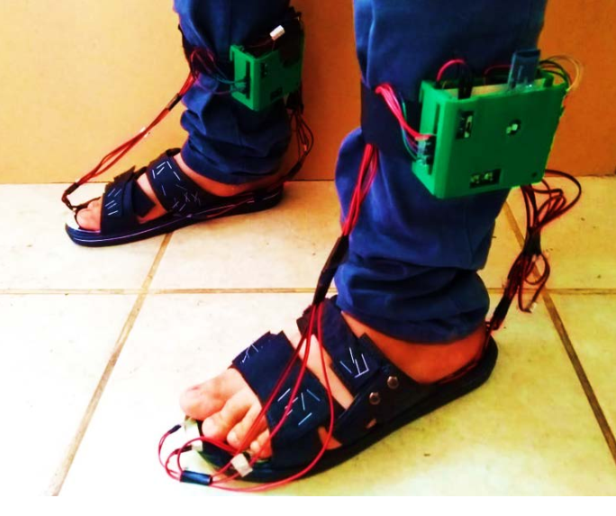

# diabetes_diagnosis
This projects stands for diabetes neuropathy diagnosis using machine learning algorithms

# The prototype

# Reference
Tincopa, 2019. Tesis de maestria. DISEÑO Y EVALUACIÓN DE UN SISTEMA DE AYUDA AL DIAGNÓSTICO PARA NEUROPATÍA DIABÉTICA BASADO EN LA LECTURA DE PUNTOS DE PRESIÓN PLANTAR Y MACHINE LEARNING. Universidad Peruana Cayetano Heredia
